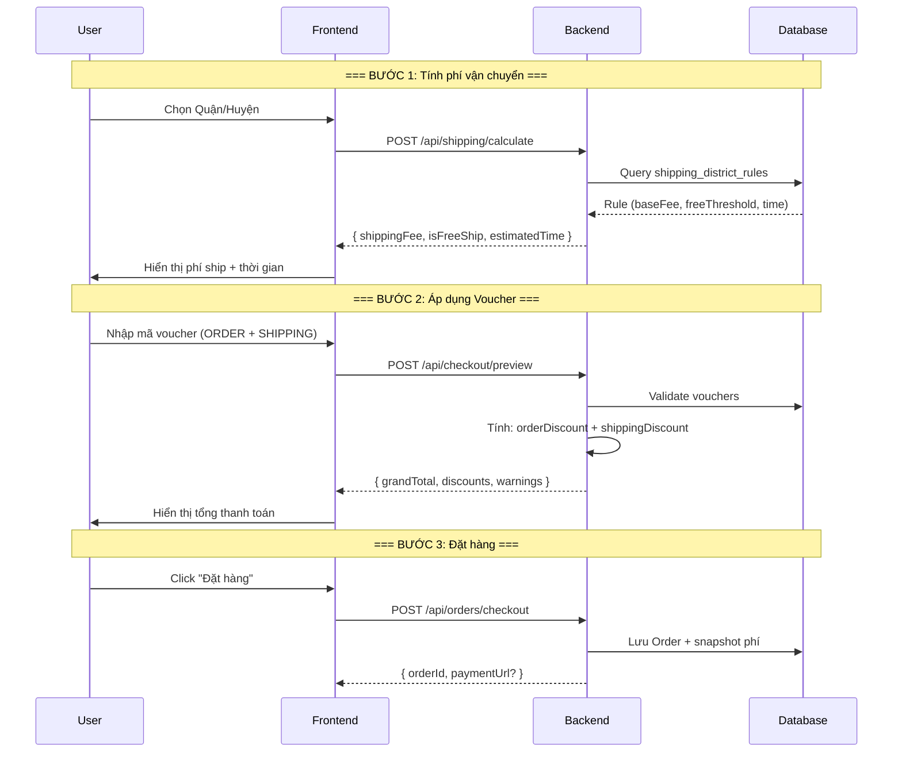

# 🚚 Kế Hoạch Triển Khai: Phí Vận Chuyển Động + Voucher

> **Phiên bản:** 1.0  
> **Ngày:** 2026-01-20  
> **Dự án:** FlowerCorner - Shop Hoa TP.HCM

---

## 📋 Mục Lục

1. [Flow Checkout (Mermaid)](#1-flow-checkout)
2. [Database Design](#2-database-design)
3. [API REST](#3-api-rest)
4. [Rule Tính Phí](#4-rule-tính-phí)
5. [Voucher Mapping](#5-voucher-mapping)
6. [Backend Implementation](#6-backend-implementation)
7. [Frontend Implementation](#7-frontend-implementation)

---

## 1. Flow Checkout



---

## 2. Database Design

### 2.1. Bảng `shipping_district_rules`

```sql
-- Tạo bảng shipping_district_rules
CREATE TABLE shipping_district_rules (
    id BIGINT PRIMARY KEY AUTO_INCREMENT,
    city VARCHAR(50) NOT NULL DEFAULT 'TPHCM',
    district VARCHAR(100) NOT NULL,
    zone ENUM('INNER', 'OUTER') NOT NULL,
    delivery_type ENUM('STANDARD', 'RUSH') NOT NULL DEFAULT 'STANDARD',
    base_fee INT NOT NULL COMMENT 'Phí cơ bản (VND)',
    free_ship_threshold INT NOT NULL COMMENT 'Miễn phí từ (VND)',
    estimated_time VARCHAR(20) NOT NULL COMMENT 'Thời gian giao dự kiến',
    peak_fee INT DEFAULT 0 COMMENT 'Phí cao điểm',
    holiday_multiplier DECIMAL(3,2) DEFAULT 1.0,
    active BOOLEAN DEFAULT TRUE,
    created_at TIMESTAMP DEFAULT CURRENT_TIMESTAMP,
    updated_at TIMESTAMP DEFAULT CURRENT_TIMESTAMP ON UPDATE CURRENT_TIMESTAMP,

    UNIQUE KEY uk_district_delivery (city, district, delivery_type),
    INDEX idx_active_city (active, city)
) ENGINE=InnoDB DEFAULT CHARSET=utf8mb4;
```

### 2.2. Seed Data TP.HCM

```sql
-- Xóa dữ liệu cũ
DELETE FROM shipping_district_rules WHERE city = 'TPHCM';

-- ===== NỘI THÀNH (13 quận) - Fee: 25k, Free từ 500k =====
INSERT INTO shipping_district_rules
(city, district, zone, delivery_type, base_fee, free_ship_threshold, estimated_time) VALUES
('TPHCM', 'Quận 1', 'INNER', 'STANDARD', 25000, 500000, '2-4 giờ'),
('TPHCM', 'Quận 3', 'INNER', 'STANDARD', 25000, 500000, '2-4 giờ'),
('TPHCM', 'Quận 4', 'INNER', 'STANDARD', 25000, 500000, '2-4 giờ'),
('TPHCM', 'Quận 5', 'INNER', 'STANDARD', 25000, 500000, '2-4 giờ'),
('TPHCM', 'Quận 6', 'INNER', 'STANDARD', 25000, 500000, '2-4 giờ'),
('TPHCM', 'Quận 7', 'INNER', 'STANDARD', 25000, 500000, '2-4 giờ'),
('TPHCM', 'Quận 8', 'INNER', 'STANDARD', 25000, 500000, '2-4 giờ'),
('TPHCM', 'Quận 10', 'INNER', 'STANDARD', 25000, 500000, '2-4 giờ'),
('TPHCM', 'Quận 11', 'INNER', 'STANDARD', 25000, 500000, '2-4 giờ'),
('TPHCM', 'Quận Gò Vấp', 'INNER', 'STANDARD', 25000, 500000, '2-4 giờ'),
('TPHCM', 'Quận Bình Thạnh', 'INNER', 'STANDARD', 25000, 500000, '2-4 giờ'),
('TPHCM', 'Quận Phú Nhuận', 'INNER', 'STANDARD', 25000, 500000, '2-4 giờ'),
('TPHCM', 'Quận Tân Bình', 'INNER', 'STANDARD', 25000, 500000, '2-4 giờ');

-- ===== NGOẠI THÀNH (9 quận/huyện) - Free từ 700k =====
INSERT INTO shipping_district_rules
(city, district, zone, delivery_type, base_fee, free_ship_threshold, estimated_time) VALUES
('TPHCM', 'Quận 12', 'OUTER', 'STANDARD', 35000, 700000, '4-5 giờ'),
('TPHCM', 'TP. Thủ Đức', 'OUTER', 'STANDARD', 35000, 700000, '4-5 giờ'),
('TPHCM', 'Quận Bình Tân', 'OUTER', 'STANDARD', 35000, 700000, '4-5 giờ'),
('TPHCM', 'Quận Tân Phú', 'OUTER', 'STANDARD', 30000, 700000, '3-4 giờ'),
('TPHCM', 'Huyện Hóc Môn', 'OUTER', 'STANDARD', 40000, 700000, '5-6 giờ'),
('TPHCM', 'Huyện Củ Chi', 'OUTER', 'STANDARD', 45000, 700000, '5-6 giờ'),
('TPHCM', 'Huyện Bình Chánh', 'OUTER', 'STANDARD', 40000, 700000, '5-6 giờ'),
('TPHCM', 'Huyện Nhà Bè', 'OUTER', 'STANDARD', 40000, 700000, '5-6 giờ'),
('TPHCM', 'Huyện Cần Giờ', 'OUTER', 'STANDARD', 60000, 700000, '1 ngày');
```

### 2.3. Mở rộng bảng `vouchers`

```sql
-- Thêm cột type để phân biệt voucher ORDER vs SHIPPING
ALTER TABLE vouchers ADD COLUMN voucher_type ENUM('ORDER', 'SHIPPING')
    NOT NULL DEFAULT 'ORDER' AFTER discount_type;

-- Thêm cột optional: áp dụng cho zone/district cụ thể
ALTER TABLE vouchers ADD COLUMN applicable_zones VARCHAR(100) NULL
    COMMENT 'JSON array: ["INNER","OUTER"] hoặc null = tất cả';
```

---

## 3. API REST

### 3.1. POST /api/shipping/calculate

**Request:**

```json
{
  "city": "TPHCM",
  "district": "Quận 1",
  "subtotal": 450000,
  "deliveryType": "STANDARD"
}
```

**Response 200:**

```json
{
  "success": true,
  "data": {
    "ruleId": 1,
    "zone": "INNER",
    "originalFee": 25000,
    "shippingFee": 25000,
    "isFreeShip": false,
    "freeShipThreshold": 500000,
    "amountToFreeShip": 50000,
    "estimatedTime": "2-4 giờ"
  }
}
```

### 3.2. POST /api/checkout/preview

**Request:**

```json
{
  "subtotal": 450000,
  "district": "Quận 1",
  "deliveryType": "STANDARD",
  "vouchers": {
    "orderVoucherCode": "GIAM10",
    "shippingVoucherCode": "FREESHIP"
  }
}
```

**Response 200:**

```json
{
  "success": true,
  "data": {
    "subtotal": 450000,
    "shippingOriginal": 25000,
    "orderDiscount": 45000,
    "subtotalAfterDiscount": 405000,
    "shippingDiscount": 25000,
    "shippingFinal": 0,
    "grandTotal": 405000,
    "appliedVouchers": [
      { "code": "GIAM10", "type": "ORDER", "discount": 45000 },
      { "code": "FREESHIP", "type": "SHIPPING", "discount": 25000 }
    ],
    "warnings": []
  }
}
```

---

## 4. Rule Tính Phí

### 4.1. Công thức

```
1. originalFee = base_fee + (isPeakHour ? peak_fee : 0)
2. originalFee *= holiday_multiplier (nếu ngày lễ)
3. shippingFee = (subtotal >= free_ship_threshold) ? 0 : originalFee
4. shippingFinal = max(0, shippingFee - shippingDiscount)
5. grandTotal = (subtotal - orderDiscount) + shippingFinal
```

### 4.2. Pseudocode

```java
public ShippingResult calculateShipping(ShippingRequest req) {
    // 1. Tìm rule
    var rule = repo.findByDistrictAndDeliveryType(
        req.city, req.district, req.deliveryType
    );
    if (rule == null) throw new DistrictNotSupportedException();

    // 2. Tính phí gốc
    int originalFee = rule.baseFee;
    if (isPeakHour()) originalFee += rule.peakFee;
    if (isHoliday()) originalFee *= rule.holidayMultiplier;

    // 3. Kiểm tra miễn phí
    boolean isFreeShip = req.subtotal >= rule.freeShipThreshold;
    int shippingFee = isFreeShip ? 0 : originalFee;

    // 4. Trả về
    return ShippingResult.builder()
        .ruleId(rule.id)
        .zone(rule.zone)
        .originalFee(originalFee)
        .shippingFee(shippingFee)
        .isFreeShip(isFreeShip)
        .freeShipThreshold(rule.freeShipThreshold)
        .estimatedTime(rule.estimatedTime)
        .build();
}
```

---

## 5. Voucher Mapping

### 5.1. Hai loại Voucher

| Type       | Áp dụng lên          | Ví dụ                   |
| ---------- | -------------------- | ----------------------- |
| `ORDER`    | Subtotal (tiền hàng) | Giảm 10%, tối đa 50k    |
| `SHIPPING` | Shipping fee         | Freeship, giảm 20k ship |

### 5.2. Thứ tự xử lý

```
1. Tính shippingFee từ rule
2. Validate + áp dụng ORDER voucher → orderDiscount
3. Validate + áp dụng SHIPPING voucher → shippingDiscount
4. shippingFinal = max(0, shippingFee - shippingDiscount)
5. grandTotal = (subtotal - orderDiscount) + shippingFinal
```

### 5.3. Edge Cases

| Case                       | Xử lý                                       |
| -------------------------- | ------------------------------------------- |
| Ship đã free               | Voucher SHIPPING không có tác dụng, warning |
| Voucher SHIPPING > shipFee | shippingFinal = 0, không âm                 |
| minOrderAmount không đủ    | Báo lỗi, không áp dụng                      |
| Voucher hết hạn/hết lượt   | Báo lỗi cụ thể                              |
| 2 voucher cùng type        | Chỉ cho phép 1 mỗi loại                     |

---

## 6. Backend Implementation

### 6.1. Entity

```java
@Entity
@Table(name = "shipping_district_rules")
public class ShippingDistrictRule {
    @Id @GeneratedValue
    private Long id;
    private String city;
    private String district;

    @Enumerated(EnumType.STRING)
    private Zone zone; // INNER, OUTER

    @Enumerated(EnumType.STRING)
    private DeliveryType deliveryType;

    private Integer baseFee;
    private Integer freeShipThreshold;
    private String estimatedTime;
    private Integer peakFee;
    private BigDecimal holidayMultiplier;
    private Boolean active;
}
```

### 6.2. Repository

```java
@Repository
public interface ShippingRuleRepository extends JpaRepository<ShippingDistrictRule, Long> {

    @Query("""
        SELECT r FROM ShippingDistrictRule r
        WHERE r.city = :city AND r.district = :district
        AND r.deliveryType = :type AND r.active = true
    """)
    Optional<ShippingDistrictRule> findRule(
        String city, String district, DeliveryType type
    );

    List<ShippingDistrictRule> findByCityAndActiveTrue(String city);
}
```

### 6.3. Service

```java
@Service
@RequiredArgsConstructor
public class ShippingService {

    private final ShippingRuleRepository ruleRepo;
    private final VoucherService voucherService;

    public ShippingCalculateResponse calculate(ShippingCalculateRequest req) {
        var rule = ruleRepo.findRule(req.city, req.district, req.deliveryType)
            .orElseThrow(() -> new DistrictNotSupportedException(req.district));

        int originalFee = rule.getBaseFee();
        boolean isFreeShip = req.getSubtotal() >= rule.getFreeShipThreshold();
        int shippingFee = isFreeShip ? 0 : originalFee;

        return ShippingCalculateResponse.builder()
            .ruleId(rule.getId())
            .zone(rule.getZone())
            .originalFee(originalFee)
            .shippingFee(shippingFee)
            .isFreeShip(isFreeShip)
            .freeShipThreshold(rule.getFreeShipThreshold())
            .amountToFreeShip(Math.max(0, rule.getFreeShipThreshold() - req.getSubtotal()))
            .estimatedTime(rule.getEstimatedTime())
            .build();
    }

    public CheckoutPreviewResponse preview(CheckoutPreviewRequest req) {
        // 1. Tính ship
        var shipping = calculate(ShippingCalculateRequest.from(req));

        // 2. Validate ORDER voucher
        int orderDiscount = 0;
        if (req.getOrderVoucherCode() != null) {
            orderDiscount = voucherService.calculateDiscount(
                req.getOrderVoucherCode(), VoucherType.ORDER, req.getSubtotal()
            );
        }

        // 3. Validate SHIPPING voucher
        int shippingDiscount = 0;
        if (req.getShippingVoucherCode() != null && shipping.getShippingFee() > 0) {
            shippingDiscount = voucherService.calculateDiscount(
                req.getShippingVoucherCode(), VoucherType.SHIPPING, shipping.getShippingFee()
            );
        }

        // 4. Tính tổng
        int shippingFinal = Math.max(0, shipping.getShippingFee() - shippingDiscount);
        int grandTotal = (req.getSubtotal() - orderDiscount) + shippingFinal;

        return CheckoutPreviewResponse.builder()
            .subtotal(req.getSubtotal())
            .shippingOriginal(shipping.getOriginalFee())
            .orderDiscount(orderDiscount)
            .shippingDiscount(shippingDiscount)
            .shippingFinal(shippingFinal)
            .grandTotal(grandTotal)
            .build();
    }
}
```

### 6.4. Controller

```java
@RestController
@RequestMapping("/api/shipping")
@RequiredArgsConstructor
public class ShippingController {

    private final ShippingService shippingService;

    @PostMapping("/calculate")
    public ResponseEntity<ApiResponse<ShippingCalculateResponse>> calculate(
        @Valid @RequestBody ShippingCalculateRequest request
    ) {
        var result = shippingService.calculate(request);
        return ResponseEntity.ok(ApiResponse.success(result));
    }
}

@RestController
@RequestMapping("/api/checkout")
@RequiredArgsConstructor
public class CheckoutController {

    private final ShippingService shippingService;

    @PostMapping("/preview")
    public ResponseEntity<ApiResponse<CheckoutPreviewResponse>> preview(
        @Valid @RequestBody CheckoutPreviewRequest request
    ) {
        var result = shippingService.preview(request);
        return ResponseEntity.ok(ApiResponse.success(result));
    }
}
```

---

## 7. Frontend Implementation

### 7.1. State Management

```javascript
// useCheckoutShipping.js
const useCheckoutShipping = () => {
  const [state, setState] = useState({
    // Shipping
    district: "",
    deliveryType: "STANDARD",
    shippingFee: 0,
    originalFee: 0,
    isFreeShip: false,
    freeShipThreshold: 0,
    estimatedTime: "",

    // Vouchers
    orderVoucherCode: "",
    shippingVoucherCode: "",
    orderDiscount: 0,
    shippingDiscount: 0,

    // Totals
    subtotal: 0,
    grandTotal: 0,

    // UI
    loading: false,
  });

  // Gọi khi district/subtotal thay đổi
  const calculateShipping = async () => {
    const res = await shippingApi.calculate({
      city: "TPHCM",
      district: state.district,
      subtotal: state.subtotal,
      deliveryType: state.deliveryType,
    });

    setState((prev) => ({
      ...prev,
      shippingFee: res.data.shippingFee,
      originalFee: res.data.originalFee,
      isFreeShip: res.data.isFreeShip,
      freeShipThreshold: res.data.freeShipThreshold,
      estimatedTime: res.data.estimatedTime,
    }));
  };

  // Gọi khi voucher thay đổi
  const previewCheckout = async () => {
    const res = await checkoutApi.preview({
      subtotal: state.subtotal,
      district: state.district,
      deliveryType: state.deliveryType,
      vouchers: {
        orderVoucherCode: state.orderVoucherCode,
        shippingVoucherCode: state.shippingVoucherCode,
      },
    });

    setState((prev) => ({
      ...prev,
      orderDiscount: res.data.orderDiscount,
      shippingDiscount: res.data.shippingDiscount,
      shippingFee: res.data.shippingFinal,
      grandTotal: res.data.grandTotal,
    }));
  };

  return { state, calculateShipping, previewCheckout, setState };
};
```

### 7.2. UI Component

```jsx
// ShippingSummary.jsx
const ShippingSummary = ({ shipping, subtotal }) => (
  <div className="bg-blue-50 rounded-xl p-4">
    <div className="flex justify-between mb-2">
      <span>Phí vận chuyển:</span>
      <span className={shipping.isFreeShip ? "text-green-600" : ""}>
        {shipping.isFreeShip ? "Miễn phí" : formatPrice(shipping.shippingFee)}
      </span>
    </div>

    {!shipping.isFreeShip && (
      <p className="text-sm text-blue-600">
        🎁 Mua thêm {formatPrice(shipping.freeShipThreshold - subtotal)} để được
        miễn phí ship!
      </p>
    )}

    <p className="text-sm text-gray-500 mt-2">
      ⏱️ Thời gian giao: {shipping.estimatedTime}
    </p>
  </div>
);
```

### 7.3. Voucher Input

```jsx
// VoucherInput.jsx
const VoucherInput = ({ type, value, onChange, onApply }) => (
  <div className="flex gap-2">
    <input
      type="text"
      value={value}
      onChange={(e) => onChange(e.target.value)}
      placeholder={
        type === "ORDER" ? "Mã giảm giá sản phẩm" : "Mã giảm phí ship"
      }
      className="flex-1 px-4 py-2 border rounded-lg"
    />
    <button
      onClick={onApply}
      className="px-4 py-2 bg-pink-500 text-white rounded-lg"
    >
      Áp dụng
    </button>
  </div>
);
```

---

## 📌 Tóm Tắt Triển Khai

| Bước | Công việc                                 | File/Table |
| ---- | ----------------------------------------- | ---------- |
| 1    | Tạo bảng `shipping_district_rules`        | SQL        |
| 2    | Seed dữ liệu 22 quận/huyện TP.HCM         | SQL        |
| 3    | Thêm cột `voucher_type` vào bảng vouchers | SQL        |
| 4    | Tạo Entity + Repository                   | Java       |
| 5    | Tạo ShippingService                       | Java       |
| 6    | Tạo Controller endpoints                  | Java       |
| 7    | Tạo hook useCheckoutShipping              | React      |
| 8    | Cập nhật CheckoutPage UI                  | React      |

---

**✅ Hoàn thành! Đây là kế hoạch đầy đủ để triển khai tính năng phí vận chuyển động với voucher.**
